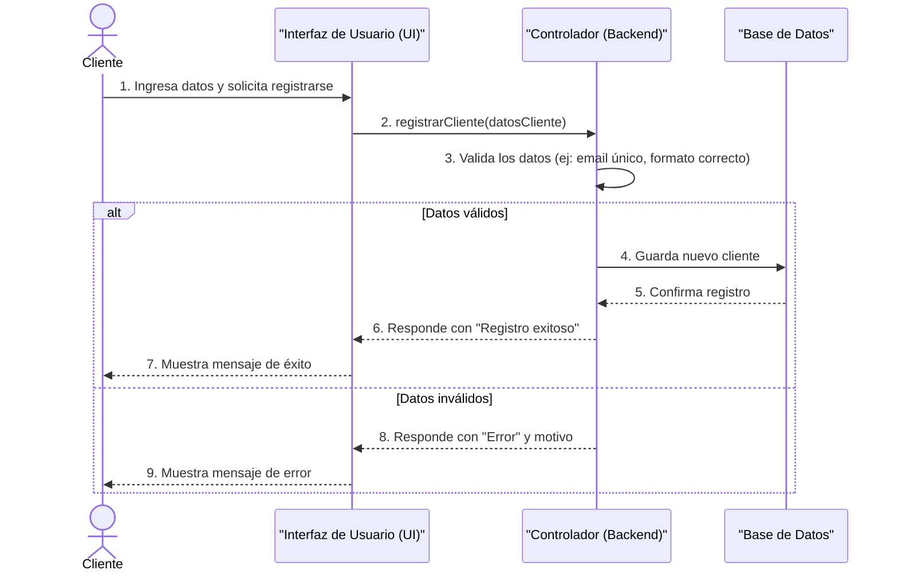
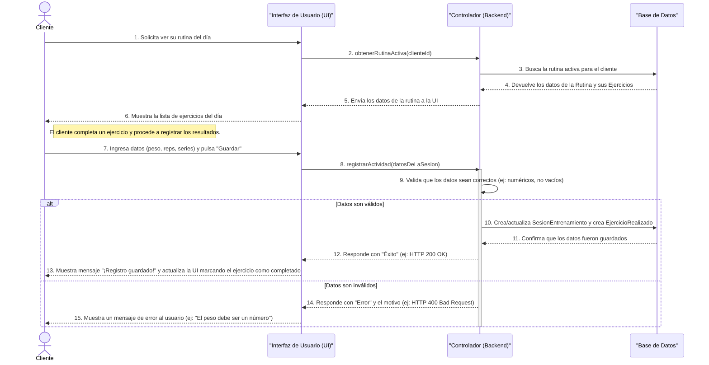

## Diagrama 1: Registro de nuevo cliente

```mermaid
sequenceDiagram
actor Cliente
participant Sistema as "Interfaz de Usuario (UI)"
participant Controlador as "Controlador (Backend)"
participant BaseDeDatos as "Base de Datos"

    Cliente->>Sistema: 1. Ingresa datos y solicita registrarse
    Sistema->>Controlador: 2. registrarCliente(datosCliente)
    Controlador->>Controlador: 3. Valida los datos (ej: email único, formato correcto)
    alt Datos válidos
        Controlador->>BaseDeDatos: 4. Guarda nuevo cliente
        BaseDeDatos-->>Controlador: 5. Confirma registro
        Controlador-->>Sistema: 6. Responde con "Registro exitoso"
        Sistema-->>Cliente: 7. Muestra mensaje de éxito
    else Datos inválidos
        Controlador-->>Sistema: 8. Responde con "Error" y motivo
        Sistema-->>Cliente: 9. Muestra mensaje de error
    end
```
## Diagrama 2: Visualización y registro de rutina

```mermaid
sequenceDiagram
actor Cliente
participant Sistema as "Interfaz de Usuario (UI)"
participant Controlador as "Controlador (Backend)"
participant BaseDeDatos as "Base de Datos"

    %% -- Parte 1: El cliente visualiza su rutina --
    Cliente->>Sistema: 1. Solicita ver su rutina del día
    Sistema->>Controlador: 2. obtenerRutinaActiva(clienteId)
    Controlador->>BaseDeDatos: 3. Busca la rutina activa para el cliente
    BaseDeDatos-->>Controlador: 4. Devuelve los datos de la Rutina y sus Ejercicios
    Controlador-->>Sistema: 5. Envía los datos de la rutina a la UI
    Sistema-->>Cliente: 6. Muestra la lista de ejercicios del día

    %% -- Parte 2: El cliente registra un ejercicio realizado --
    note right of Cliente: El cliente completa un ejercicio y procede a registrar los resultados.
    Cliente->>Sistema: 7. Ingresa datos (peso, reps, series) y pulsa "Guardar"
    Sistema->>Controlador: 8. registrarActividad(datosDeLaSesion)
    activate Controlador
    Controlador->>Controlador: 9. Valida que los datos sean correctos (ej: numéricos, no vacíos)
    alt Datos son válidos
        Controlador->>BaseDeDatos: 10. Crea/actualiza SesionEntrenamiento y crea EjercicioRealizado
        BaseDeDatos-->>Controlador: 11. Confirma que los datos fueron guardados
        Controlador-->>Sistema: 12. Responde con "Éxito" (ej: HTTP 200 OK)
        Sistema-->>Cliente: 13. Muestra mensaje "¡Registro guardado!" y actualiza la UI marcando el ejercicio como completado
    else Datos son inválidos
        Controlador-->>Sistema: 14. Responde con "Error" y el motivo (ej: HTTP 400 Bad Request)
        Sistema-->>Cliente: 15. Muestra un mensaje de error al usuario (ej: "El peso debe ser un número")
    end
    deactivate Controlador
```